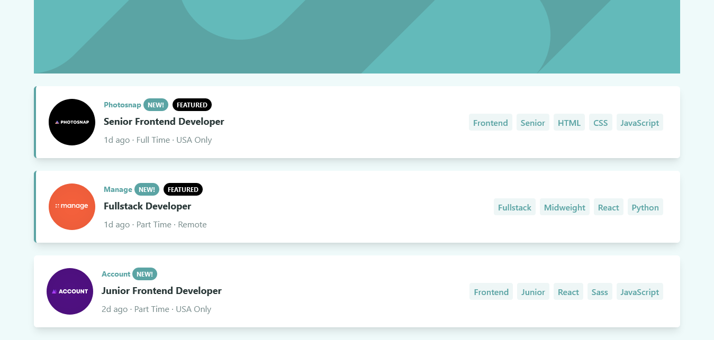

# Frontend Mentor - Job listings with filtering solution

So I spent the afternoon learning Tailwind. Figured I might as well put it to use with my newly acquired react skills.

This is a solution to the [Job listings with filtering challenge on Frontend Mentor](https://www.frontendmentor.io/challenges/job-listings-with-filtering-ivstIPCt). Frontend Mentor challenges help you improve your coding skills by building realistic projects.

## Table of contents

- [Overview](#overview)
  - [The challenge](#the-challenge)
  - [Screenshot](#screenshot)
  - [Links](#links)
- [My process](#my-process)
  - [Built with](#built-with)
  - [Useful resources](#useful-resources)
- [Author](#author)

**Note: Delete this note and update the table of contents based on what sections you keep.**

## Overview

### The challenge

Users should be able to:

- View the optimal layout for the site depending on their device's screen size
- See hover states for all interactive elements on the page
- Filter job listings based on the categories

### Screenshot

### Links

- Solution URL: [https://chinyangatl/job-listings-filter-react](https://chinyangatl/job-listings-filter-react)
- Live Site URL: [https://react-job-listings-filter.netlify.app/](https://react-job-listings-filter.netlify.app/)

## My process

### Built with

- Semantic HTML5 markup
- Flexbox
- CSS Grid
- Mobile-first workflow
- [React](https://reactjs.org/) - JS library
- [Tailwind](https://tailwindcss.com/) - CSS Framewok

### Useful resources

- [Florin Pop](https://www.youtube.com/watch?v=JZQ8m08cbF0&list=PLgBH1CvjOA63Xvt0BaeQ7zL4KXX96Wbgp&index=15) - Helped greatly with the logic of the multi filter part

## Author

- Website - [Github](https://github.com/ChinyangaTL)
- Frontend Mentor - [@beyonce-beytwice](https://www.frontendmentor.io/profile/beyonce-beytwice)
